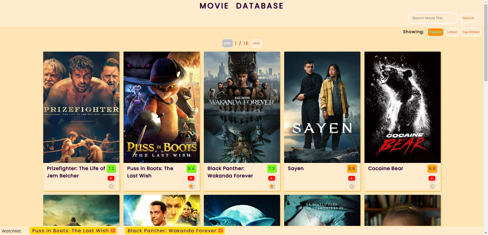
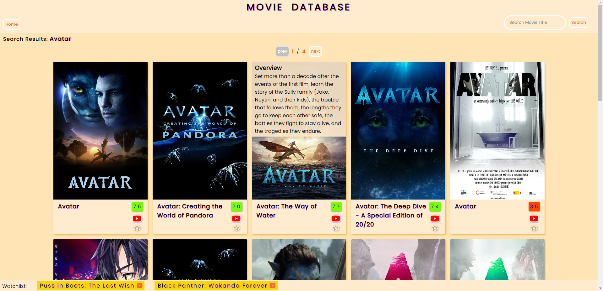

# Movie Database App

**App URL:** https://cclemonnn.github.io/Movie-Database/

This app is a movie database that allows users to search movies, add them to a watchlist, and watch their trailers. It is built using HTML, CSS, and Vanilla Javascript, and it utilizes [The Movie Database (TMDB) API](https://www.themoviedb.org/documentation/api) to load movie data.

---

## Features

### Movie Watchlist

The app allows users to add up to 5 movies to their watchlist by clicking the star button at the bottom of each movie box. To remove a movie from the watchlist, the user can either click the star button again or click the X-mark of the movie in the watchlist. The watchlist is saved in local storage so that it persists across sessions.

### Movie Trailer Player

Users can watch the official movie trailer by clicking the YouTube logo at the bottom of each movie box.

### Movie Search

Users can search for movies by entering the desired movie title in the search box. The app will load and display relevant movies based on the user's search query.

### Movie Overview

When the user hovers over a movie box, the app displays an overview of the movie, providing more information about the movie's plot, cast, rating, and other details.

---

## Acknowledgements

This project was inspired by the [movie app project](https://github.com/bradtraversy/50projects50days/tree/master/movie-app)
from a [Udemy course](https://www.udemy.com/course/50-projects-50-days/) by Brad Traversy. The project was built by Peter Tseng.

---

## Contact

If you have any questions or feedback, please feel free to reach out to me at tsenghouhan@gmail.com
