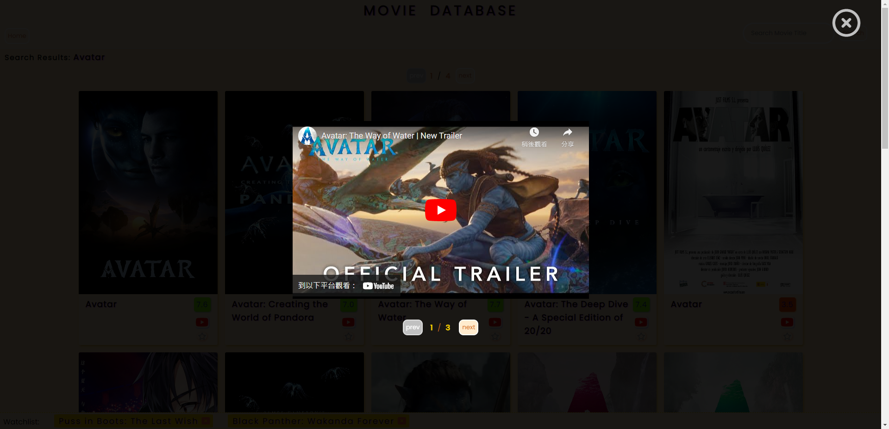

# Movie Database App (電影資料庫)

**App URL:** https://cclemonnn.github.io/Movie-Database/

This app is a movie database that allows users to search movies, add them to a watchlist, and watch their trailers.

此專案是一個電影資料庫，允許使用者搜尋電影、將它們加入觀看清單以及觀看它們的預告片。

---

## Project Skills (專案技能)

Integrating The Movie Database (TMDB) API, Vanilla Javascript (ES6), CSS3, HTML5.

---

## Features (功能)

### Movie Watchlist (電影觀看清單)

- The app allows users to add up to 5 movies to their watchlist by clicking the star button at the bottom of each movie box. To remove a movie from the watchlist, the user can either click the star button again or click the X-mark of the movie in the watchlist. The watchlist is saved in local storage so that it persists across sessions.

- 此應用程式允許使用者按下每部電影方塊底部的星星按鈕，將最多 5 部電影加入觀看清單。若要從觀看清單中移除電影，使用者可以再次點擊星星按鈕或點擊觀看清單中電影的 X 標記。觀看清單儲存在 local storage。
  

### Movie Trailer Player (電影預告片播放器)

- Users can watch the official movie trailer by clicking the YouTube logo at the bottom of each movie box.

- 使用者可以點擊每個電影方塊底部的 YouTube 標誌觀看官方電影預告片。
  
  

### Movie Search (電影搜尋)

- Users can search for movies by entering the desired movie title in the search box. The app will load and display relevant movies based on the user's search query.

- 使用者可以輸入想要搜尋的電影標題，以搜尋所需的電影。應用程式將根據使用者的搜尋查詢載入和顯示相關電影。
  

### Movie Overview (電影總覽)

- When the user hovers over a movie box, the app displays an overview of the movie, providing more information about the movie's plot, cast, rating, and other details.

- 當使用者將滑鼠移至電影方塊上時，應用程式會顯示有關該電影的概述，提供有關該電影的情節、演員、評分和其他詳細信息。
  
